# 🐳 Documentação dos Dockerfiles

## 📋 Visão Geral

Este projeto utiliza uma arquitetura Docker multi-container otimizada para desenvolvimento e produção. Os Dockerfiles foram refatorados para seguir as melhores práticas.

## 🏗️ Arquitetura

```
┌─────────────────────────────────────────────────────────────┐
│                     Docker Compose                          │
├─────────────┬─────────────┬─────────────┬──────────────────┤
│   Backend   │   Nginx     │  Frontend   │     MySQL        │
│  (PHP-FPM)  │ (Web Server)│ (React+Vite)│  (Database)      │
│  Port: 9000 │  Port: 8000 │ Port: 3001  │   Port: 3306     │
└─────────────┴─────────────┴─────────────┴──────────────────┘
```

---

## 📁 Estrutura de Arquivos Docker

```
estoque/
├── docker-compose.yml          # Orquestração principal
├── .dockerignore              # Arquivos ignorados no build
├── .env.example               # Variáveis de ambiente
├── Makefile                   # Comandos úteis
├── backend/
│   └── Dockerfile             # Backend PHP-FPM (Multi-stage)
├── docker/
│   ├── frontend/
│   │   └── Dockerfile         # Frontend React (Multi-stage)
│   ├── nginx/
│   │   └── default.conf       # Configuração Nginx
│   ├── mysql/
│   │   └── my.cnf            # Configuração MySQL
│   └── php/
│       └── Dockerfile         # ⚠️ DEPRECADO - Usar backend/Dockerfile
└── backend/api/
    └── docker-entrypoint.sh   # Script de inicialização
```

---

## 🔧 Dockerfiles Detalhados

### 1️⃣ Backend Dockerfile (`backend/Dockerfile`)

**Tecnologia:** PHP 8.2 FPM + Laravel 12 + Composer

**Características:**
- ✅ Multi-stage build (reduz tamanho da imagem)
- ✅ Alpine Linux (imagem menor e mais segura)
- ✅ Otimizações para produção (OPcache, autoloader)
- ✅ Health checks configurados
- ✅ Usuário não-root (www-data)
- ✅ Configurações PHP customizadas

**Estágios:**

#### Stage 1: Composer Builder
```dockerfile
FROM composer:2.7 AS composer-builder
```
- Instala dependências do Composer
- Gera autoloader otimizado
- Não inclui dev-dependencies em produção

#### Stage 2: Production Image
```dockerfile
FROM php:8.2-fpm-alpine
```
- Imagem Alpine (leve e segura)
- Extensões PHP: pdo_mysql, mbstring, exif, pcntl, bcmath, gd, zip, opcache
- OPcache ativado e configurado
- Memory limit: 512M
- Upload max: 50M
- Timezone: America/Sao_Paulo

**Extensões PHP Instaladas:**
- `pdo_mysql` - Conexão MySQL
- `mbstring` - Manipulação de strings multibyte
- `exif` - Leitura de metadados de imagens
- `pcntl` - Controle de processos
- `bcmath` - Matemática de precisão arbitrária
- `gd` - Manipulação de imagens
- `zip` - Compressão de arquivos
- `opcache` - Cache de bytecode PHP

**Configurações Customizadas:**
```ini
memory_limit=512M
upload_max_filesize=50M
post_max_size=50M
max_execution_time=300
max_input_time=300
date.timezone=America/Sao_Paulo
```

**Health Check:**
```bash
php-fpm -t || exit 1
```

**Volumes Recomendados:**
- `/var/www/storage` - Arquivos enviados e logs
- `/var/www/bootstrap/cache` - Cache do Laravel

---

### 2️⃣ Frontend Dockerfile (`docker/frontend/Dockerfile`)

**Tecnologia:** Node.js 20 + React + Vite + TypeScript

**Características:**
- ✅ Multi-stage build (4 estágios)
- ✅ Alpine Linux
- ✅ Suporte para desenvolvimento e produção
- ✅ Hot-reload em desenvolvimento
- ✅ Build otimizado para produção com Nginx
- ✅ Usuário não-root

**Estágios:**

#### Stage 1: Dependencies
```dockerfile
FROM node:20-alpine AS deps
```
- Instala apenas dependências de produção
- Usa `npm ci` para instalação determinística

#### Stage 2: Development
```dockerfile
FROM node:20-alpine AS development
```
- Modo desenvolvimento com hot-reload
- Expõe porta 3000
- Vite dev server
- Health check via wget

#### Stage 3: Builder
```dockerfile
FROM node:20-alpine AS builder
```
- Build otimizado para produção
- Gera arquivos estáticos em `/app/dist`

#### Stage 4: Production
```dockerfile
FROM nginx:alpine AS production
```
- Serve arquivos estáticos com Nginx
- Imagem ultra-leve
- Expõe porta 80
- Ideal para deploy

**Como Usar:**

**Desenvolvimento:**
```yaml
build:
  target: development
```

**Produção:**
```yaml
build:
  target: production
```

---

### 3️⃣ Nginx Configuration (`docker/nginx/default.conf`)

**Características:**
- ✅ FastCGI configurado para PHP-FPM
- ✅ CORS habilitado
- ✅ Timeouts aumentados
- ✅ Buffer otimizado

**Configurações Principais:**
```nginx
fastcgi_pass backend:9000;
fastcgi_read_timeout 300;
fastcgi_buffer_size 128k;
```

---

### 4️⃣ MySQL Configuration (`docker/mysql/my.cnf`)

**Características:**
- ✅ UTF8MB4 (suporte completo a emojis)
- ✅ Performance otimizada
- ✅ Slow query log habilitado
- ✅ Timezone configurado

**Configurações:**
```ini
character-set-server=utf8mb4
innodb_buffer_pool_size=256M
default-time-zone='-03:00'
```

---

## 🚀 Docker Compose

### Serviços Configurados

#### 1. **Backend** (PHP-FPM)
- Container: `estoque-backend`
- Porta interna: 9000
- Health check: PHP-FPM test
- Aguarda MySQL estar saudável
- Volumes: código fonte, storage, cache

#### 2. **Nginx** (Web Server)
- Container: `estoque-nginx`
- Porta: 8000 (mapeada de 80)
- Depende do backend saudável
- Serve API Laravel

#### 3. **Frontend** (React + Vite)
- Container: `estoque-frontend`
- Porta: 3001 (mapeada de 3000)
- Hot-reload ativo
- Volume para node_modules

#### 4. **MySQL** (Database)
- Container: `estoque-mysql`
- Porta: 3306
- Volume persistente: `mysql_data`
- Health check: mysqladmin ping

#### 5. **PHPMyAdmin** (Database Manager)
- Container: `estoque-phpmyadmin`
- Porta: 8080
- Interface web para MySQL

### Volumes Persistentes

```yaml
volumes:
  mysql_data:          # Dados do MySQL
  backend_storage:     # Storage Laravel
  backend_cache:       # Cache Laravel
  frontend_node_modules: # Node modules
  nginx_logs:          # Logs Nginx
```

### Networks

```yaml
networks:
  estoque-network:
    subnet: 172.28.0.0/16
```

---

## 📝 Script de Inicialização

### docker-entrypoint.sh

**Funcionalidades:**
1. ⏳ Aguarda MySQL estar pronto
2. 📝 Cria arquivo `.env` se não existir
3. 📦 Instala dependências do Composer
4. 🔑 Gera chave da aplicação
5. 🧹 Limpa caches
6. 📚 Configura Swagger
7. 🗄️ Executa migrations
8. 🌱 Executa seeders
9. 📖 Gera documentação Swagger
10. 🔗 Cria link simbólico storage
11. ⚡ Otimiza aplicação (produção)
12. 🚀 Inicia PHP-FPM

**Output colorido e informativo:**
```
━━━━━━━━━━━━━━━━━━━━━━━━━━━━━━━━━━━━━━━━━━━━━━━━━━━━━━━━━━━━━
🚀 Sistema de Estoque - Inicializando Backend
━━━━━━━━━━━━━━━━━━━━━━━━━━━━━━━━━━━━━━━━━━━━━━━━━━━━━━━━━━━━━
```

---

## 🎯 Comandos Úteis (Makefile)

```bash
# Desenvolvimento
make dev              # Iniciar ambiente
make build            # Build imagens
make up               # Subir containers
make down             # Parar containers
make restart          # Reiniciar

# Logs
make logs             # Ver todos os logs
make logs-backend     # Logs do backend
make logs-frontend    # Logs do frontend

# Banco de Dados
make db-reset         # Resetar banco
make db-migrate       # Executar migrations
make db-seed          # Executar seeders
make db-backup        # Backup do banco

# Shell
make shell-backend    # Shell no backend
make shell-frontend   # Shell no frontend
make shell-mysql      # MySQL CLI

# Artisan
make cache-clear      # Limpar caches
make swagger          # Gerar Swagger
make artisan cmd="..."# Comando artisan customizado

# Limpeza
make clean            # Limpar containers/volumes
make clean-all        # Limpeza completa

# Testes
make test             # Executar testes
make test-coverage    # Testes com cobertura

# Informações
make info             # Ver URLs dos serviços
make ps               # Listar containers
```

---

## 🔐 Segurança

### Implementações

1. **Usuário Não-Root**
   - Backend: `www-data`
   - Frontend: `reactuser`

2. **Health Checks**
   - Todos os serviços monitorados
   - Restart automático em caso de falha

3. **Permissões Corretas**
   - Storage: 775
   - Cache: 775
   - Propriedade: www-data:www-data

4. **Variáveis de Ambiente**
   - Senhas em `.env`
   - Nunca commitar `.env`

5. **Alpine Linux**
   - Imagens menores
   - Menor superfície de ataque

---

## 📊 Comparação de Tamanhos

| Imagem | Antes | Depois | Redução |
|--------|-------|--------|---------|
| Backend | ~500MB (Debian) | ~200MB (Alpine) | 60% |
| Frontend Dev | ~400MB | ~350MB | 12% |
| Frontend Prod | ~400MB | ~50MB (Nginx) | 87% |

---

## 🏷️ Versões

| Tecnologia | Versão |
|------------|--------|
| PHP | 8.2 |
| Laravel | 12.0 |
| Node.js | 20 |
| MySQL | 8.0 |
| Nginx | 1.25 |
| Composer | 2.7 |
| Alpine | Latest |

---

## 🔄 Workflow de Desenvolvimento

```mermaid
graph LR
    A[Código Modificado] --> B[Hot Reload]
    B --> C[Container Atualizado]
    C --> D[Testes Automáticos]
    D --> E[Logs Monitorados]
```



---

## 🌐 URLs dos Serviços

- **Backend API:** http://localhost:8000
- **Swagger:** http://localhost:8000/api/documentation
- **Frontend:** http://localhost:3001
- **PHPMyAdmin:** http://localhost:8080
- **MySQL:** localhost:3306

---

## ⚡ Performance

### Otimizações Implementadas

1. **Multi-stage Builds**
   - Imagens menores
   - Build mais rápido

2. **Layer Caching**
   - Dependências cacheadas
   - Rebuild incremental

3. **OPcache**
   - Cache de bytecode PHP
   - Menos processamento

4. **Volume Mounts**
   - Hot-reload funcional
   - Performance nativa

---

## 🐛 Troubleshooting

### Problema: Container não inicia

```bash
# Ver logs
make logs-backend

# Rebuild limpo
make clean
make build
make up
```

### Problema: Permissões negadas

```bash
# Ajustar permissões
make shell-backend
chown -R www-data:www-data /var/www/storage
```

### Problema: MySQL não conecta

```bash
# Verificar health
docker ps

# Ver logs
make logs-mysql

# Aguardar inicialização completa
```

---

## 📚 Referências

- [Docker Best Practices](https://docs.docker.com/develop/dev-best-practices/)
- [Multi-stage Builds](https://docs.docker.com/build/building/multi-stage/)
- [PHP-FPM Configuration](https://www.php.net/manual/en/install.fpm.configuration.php)
- [Laravel Docker](https://laravel.com/docs/deployment#docker)

---

## 📝 Notas Importantes

1. **Dockerfile do PHP está deprecado:** Use `backend/Dockerfile`
2. **Sempre use `.dockerignore`:** Otimiza build
3. **Configure variáveis em `.env`:** Nunca hardcode
4. **Health checks são essenciais:** Garantem disponibilidade
5. **Use Alpine sempre que possível:** Segurança e tamanho

---

## 🎓 Boas Práticas Implementadas

✅ Multi-stage builds
✅ Alpine Linux base
✅ Usuário não-root
✅ Health checks
✅ .dockerignore configurado
✅ Layer caching otimizado
✅ Variáveis de ambiente
✅ Volumes nomeados
✅ Networks isoladas
✅ Logs estruturados
✅ Documentação completa

---

**Autor:** Sistema de Estoque Team  
**Última Atualização:** Dezembro 2025  
**Versão:** 2.0
